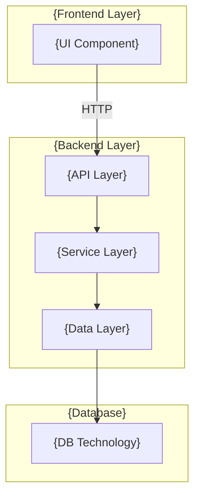
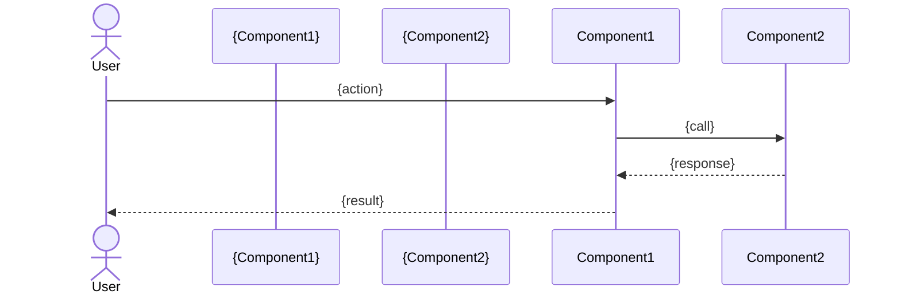
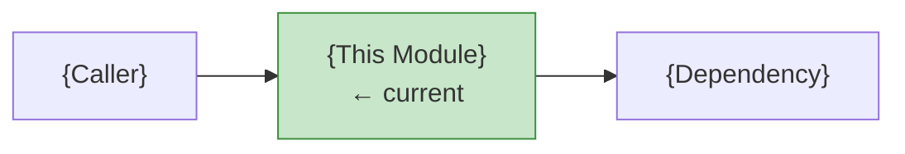

# Document Templates

Minimal templates for each wiki page type. Fill placeholders with actual project content.

---

## index.md

```markdown
# {Project Name}

[](#) [](#)

> {One-sentence project description}

{2–3 sentence overview: what it does, who uses it, key technology choices}

---

## Architecture Preview



> Full details: [Architecture](architecture.md)

---

## Documentation

| Category | Document | Description |
|----------|----------|-------------|
| 🚀 Start | [Getting Started](getting-started.md) | Setup and run |
| 🏗 Design | [Architecture](architecture.md) | System design |
| 📦 Modules | [{Domain} Overview]({domain}/_index.md) | Module details |
| 📖 API | [API Reference](api/{service}-api.md) | Endpoint docs |
| 🗺 Map | [Doc Map](doc-map.md) | Reading paths |

---

## Quick Start

```bash
# 1. Install dependencies
{install command}

# 2. Run
{run command}

# 3. Verify
{verify command}
```

---

## Module Overview

| Module | File | Responsibility |
|--------|------|----------------|
| {Name} | `{path}` | {one-line description} |
```

---

## architecture.md

```markdown
# System Architecture

> {Executive summary: what the system does, how it's structured, key design decisions. 4–5 sentences.}

## System Diagram

```mermaid
flowchart TB
    {full system with all modules and connections}
```

## Tech Stack

| Component | Technology | Version | Role |
|-----------|-----------|---------|------|
| {name} | {tech} | {ver} | {role} |

## Data Flow



## Database Schema

```mermaid
erDiagram
    {TABLE1} {
        TYPE col PK
        TYPE col
    }
    {TABLE2} {
        TYPE col PK
        TYPE col FK
    }
    TABLE1 ||--o{ TABLE2 : "relationship"
```

## Design Patterns

| Pattern | Applied In | Purpose |
|---------|-----------|---------|
| {pattern} | `{class/file}` | {why} |

## Security Risks

| ID | Type | Location | Severity |
|----|------|----------|----------|
| VUL-001 | {type} | `{location}` | 🔴 Critical |

> Details: see individual module docs.
```

---

## {module}.md

```markdown
# {ClassName / ComponentName}

## Overview

{2–3 sentences: what this module does, its role in the system, key dependencies.}

## Architecture Position



## Class Diagram

```mermaid
classDiagram
    class {ClassName} {
        <<{annotation}>>
        -{FieldType} {fieldName}
        +{ReturnType} {methodName}({params})
    }
    {ClassName} --> {Dependency} : uses
```

## Methods

### `{methodName}({params})`

{One sentence description.} Source: [📄]({file}#L{start}-L{end})

```{language}
// basic usage
{example}
```

```{language}
// error / boundary
{example}
```

```{language}
// edge case
{example}
```

---

{Repeat for each public method}

## Security Analysis

| ID | Type | Location | Severity | Fix |
|----|------|----------|----------|-----|
| VUL-001 | {type} | `{method}` | 🔴 Critical | {fix} |

> ✅ No security issues found in this module.

## Related Documents

- [{Parent}]({parent}/_index.md) — parent domain
- [{Caller}]({caller}.md) — calls this module
- [{Dependency}]({dependency}.md) — called by this module
```

---

## api/{service}-api.md

```markdown
# {Service} REST API

**Base URL**: `{base_url}`  **Auth**: {auth method or "None"}

## Endpoints

| Method | Path | Function | Risk |
|--------|------|----------|------|
| {METHOD} | `{/path}` | {description} | {risk or —} |

---

### `{METHOD} {/path}`

{One-sentence description.}

**Request**
```http
{METHOD} {url}
Content-Type: application/json

{request body if any}
```

**Parameters**

| Name | Type | Required | Description |
|------|------|----------|-------------|
| `{name}` | {type} | {Yes/No} | {desc} |

**Response** `{status}`
```json
{example response}
```

**Example (curl)**
```bash
curl -X {METHOD} {url} \
  -H "Content-Type: application/json" \
  -d '{body}'
```

---

## Error Responses

| Status | Trigger | Response |
|--------|---------|---------|
| 400 | {cause} | `{"error": "..."}` |
| 500 | {cause} | Spring default error |
```

---

## getting-started.md

```markdown
# Getting Started

## Prerequisites

| Requirement | Version | Check |
|------------|---------|-------|
| {tool} | {ver}+ | `{check command}` |

## Setup

```bash
# Clone
git clone {repo_url}

# Install
{install command}

# Configure (if needed)
cp {example.config} {config}
# Edit: {key settings}
```

## Run

```bash
# Backend
{backend start command}
# → listening on {port}

# Frontend (if applicable)
{frontend start command}
# → available at {url}
```

## Verify

```bash
curl {health_check_url}
# Expected: {"status": "ok"}
```

## Common Issues

| Issue | Cause | Fix |
|-------|-------|-----|
| {symptom} | {cause} | {fix} |
```

---

## doc-map.md

```markdown
# Documentation Map

## Document Network

```mermaid
flowchart TB
    idx[index.md] --> arch[architecture.md]
    idx --> gs[getting-started.md]
    arch --> m1[{module1}.md]
    arch --> m2[{module2}.md]
    m1 --> api[api/{service}.md]
```

## Reading Paths

| Role | Start here | Then |
|------|-----------|------|
| New member | [Getting Started](getting-started.md) | [Index](index.md) → [Architecture](architecture.md) |
| Backend dev | [Architecture](architecture.md) | Module docs → API reference |
| Frontend dev | [Architecture](architecture.md) | Frontend module docs |
| Architect | [Architecture](architecture.md) | [Doc Map](doc-map.md) |
| Security | [Architecture — Security](architecture.md#security) | Each module's Security Analysis |

## Full Index

| Document | Path | Last Updated |
|----------|------|-------------|
| {name} | `{path}` | {date} |
```
