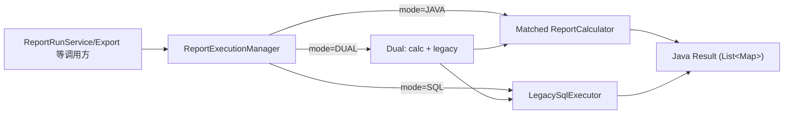

# Java Calculator 实现说明

> 描述 Calculator 在当前架构中的定位、执行流程以及典型实现方式，帮助开发者快速理解“如何把一份 SQL 报表迁移到 Java 逻辑”。

---

## 1. 组件角色

| 组件 | 职责 | 关键代码 |
|------|------|----------|
| `ReportCalculator` 接口 | 定义 `calculate` 与 `supports`，所有报表实现都遵循统一签名，返回 `List<Map<String,Object>>` | @backend/src/main/java/com/legacy/report/calculator/ReportCalculator.java#8-30 |
| Calculator 实现（如 `MerchantPerformanceAnalysisCalculator`、`CustomerSegmentationAnalysisCalculator`） | 负责查询原始表、在 Java 中完成聚合/排序/分类，并输出与 SQL 结构一致的数据 | @backend/src/main/java/com/legacy/report/calculator/impl/MerchantPerformanceAnalysisCalculator.java#22-66 @backend/src/main/java/com/legacy/report/calculator/impl/CustomerSegmentationAnalysisCalculator.java#21-82 |
| `ReportExecutionManager` | 依赖配置决定走 SQL/JAVA/DUAL；在 JAVA 或 DUAL 模式下调用匹配的 Calculator | @backend/src/main/java/com/legacy/report/service/ReportExecutionManager.java#28-140 |

---

## 2. 执行流程

1. `ReportExecutionManager` 根据 `application.yml` 中的默认/override 模式挑选执行路径。@backend/src/main/java/com/legacy/report/service/ReportExecutionManager.java#70-131
2. 当模式包含 JAVA 时，通过 `findCalculator` 遍历 Spring 容器里注册的所有 Calculator，找到 `supports(reportId)` 为 true 的实现并调用 `calculate`。@backend/src/main/java/com/legacy/report/service/ReportExecutionManager.java#133-140
3. DUAL 模式下，Java 结果作为主路径返回，同时异步执行 SQL，利用 `normalize` 比对差异并记录指标。@backend/src/main/java/com/legacy/report/service/ReportExecutionManager.java#114-201

---

## 3. Calculator 实现模式

### 3.1 读取 Domain 模型

- 通过 Spring `JdbcTemplate` 并配合 `RowMapper` 把表映射到 `calculator.model.*` 下的轻量实体，再在内存中组合。
- 例如 Merchant 报表分别查询 `merchant` 列表与成功交易，复用 `MerchantRecord`、`TransactionRecord`。@backend/src/main/java/com/legacy/report/calculator/impl/MerchantPerformanceAnalysisCalculator.java#33-105

### 3.2 聚合与衍生指标

- 典型流程：
  1. `calculate` 内部拉取多张表；
  2. 按业务维度（如 merchantId、customerId）分组；
  3. 通过 `stream().map(...).reduce` 计算总额、均值、计数等；
  4. 组装 `LinkedHashMap`，字段名与原 SQL 对齐；
  5. `rows.sort` 保持既定排序。
- Merchant 报表示例：
  - 使用 `Collectors.groupingBy(TransactionRecord::getMerchantId)` 构建交易分组；
  - 计算 `total_volume`、`avg_transaction_amount`、`estimated_commission`；
  - 最终按 `total_volume` 倒序输出。@backend/src/main/java/com/legacy/report/calculator/impl/MerchantPerformanceAnalysisCalculator.java#38-66

### 3.3 业务过滤/分类

- Calculator 可以更细致地编码业务规则，例如只统计成功交易的客户：
  - Customer Segmentation 在遍历 `customers` 时先判断 `txList` 是否为空，避免引入无交易客户；@backend/src/main/java/com/legacy/report/calculator/impl/CustomerSegmentationAnalysisCalculator.java#40-45
  - 通过 Java `if` 阶梯实现 `High/Medium/Low Value` 段位，与 SQL `CASE WHEN` 语义保持一致。@backend/src/main/java/com/legacy/report/calculator/impl/CustomerSegmentationAnalysisCalculator.java#58-76

### 3.4 输出格式

- 所有 Calculator 均返回 `List<Map<String,Object>>`，字段名、数据类型、排序顺序与原 SQL 完全一致，方便 Excel 导出与前端直接复用。
- 使用 `LinkedHashMap` 保证列顺序，同时在需要时对 `BigDecimal` 设置 `scale`，例如 `total_volume.setScale(2, RoundingMode.HALF_UP)`。@backend/src/main/java/com/legacy/report/calculator/impl/MerchantPerformanceAnalysisCalculator.java#54-60

---

## 4. 与 Legacy SQL 的协作

| 场景 | 说明 |
|------|------|
| 灰度 | DUAL 模式下 Calculator 结果会与 Legacy SQL 结果异步比较，通过 `normalize` 统一大小写与顺序；差异会进入日志与 Micrometer 计数器。@backend/src/main/java/com/legacy/report/service/ReportExecutionManager.java#142-201 |
| 回滚 | 如果某个 Calculator 出现异常，只需把对应报表的 override 改回 `SQL`，ExecutionManager 会直接调用 `LegacySqlExecutor` |
| 审批/导出 | `ReportRunService` 会在执行时记录 `executionMode` 与 `result_snapshot`，无论 Java 还是 SQL，都可以被 Checker、导出模块复用 |

---

## 5. 实现指引

1. 新增报表时先实现 `ReportCalculator`，以报表 ID 固化 `supports`，保证不会与其他报表冲突。
2. 查询语句尽量保持简单，把复杂聚合留在 Java 里完成，便于单元测试与调试。
3. 对外字段名、排序、保留小数位必须与原 SQL 完全一致，以确保 Parity 能 100% 通过并避免前端回归。
4. 将 Calculator 标注为 `@Component` 以便自动注入，ExecutionManager 会自动发现。
5. 所有业务分支建议配套 `@JdbcTest` 单元测试，重放 `schema.sql` + `data.sql` 即可验证。
