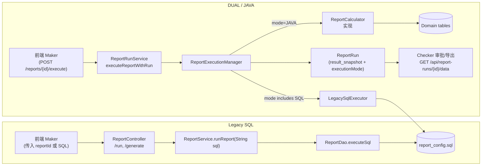

# 报表执行：Legacy SQL vs DUAL/JAVA 模式对比

> 面向后端开发、QA 与运维，用于理解“旧版 SQL 执行链路”与“现行 DUAL/JAVA 模式”在 **调用栈、配置、监控** 上的差异，便于切换和排障。

---

## 1. 总览

| 维度 | Legacy SQL 模式（改造前） | DUAL / JAVA 模式（改造后） |
|------|--------------------------|----------------------------|
| 主入口 | `ReportController#runReport`、`ReportService#runReport(sql)` 直接执行 `report_config.sql` | `ReportRunService#executeReportWithRun` → `ReportExecutionManager#execute(reportId, context)` |
| 数据来源 | `report_config` 中的 SQL 字符串，经 `ReportDao.executeSql(sql)` 直连 H2/MySQL | Calculator 逐报表读取 domain model（`customer`, `transaction`, ...），用 Java 聚合 |
| 风险 | 1) 任意 SQL 注入；2) 无法复用结果；3) 无灰度能力 | 1) 通过 `application.yml` 配置滞后切换；2) 可落地 result snapshot & parity 日志；3) Checker 读取快照，无需重跑 |
| 灰度策略 | 无，所有请求都是 SQL | `report.execution.mode={SQL|DUAL|JAVA}` + `overrides` 按报表 ID 控制 |
| 质量保障 | 只能依赖数据.sql；无 parity 校验 | Calculator 单测 + `ReportParityTest`（DUAL 模式自动对比 SQL vs JAVA） |
| 运行日志 | 仅有 JdbcTemplate 日志 | `report.parity.diff` 计数器、`ReportExecutionManager` 的 parity warn、`ReportRun.executionMode` 字段 |

---

## 2. 执行链路对比



| 节点 | Legacy SQL | DUAL/JAVA |
|------|------------|-----------|
| 输入 | 前端可提交任意 SQL 字符串 | 只接受报表 ID；执行逻辑由服务器控制 |
| 执行 | `JdbcTemplate.queryForList(sql)` | `ReportExecutionManager#getExecutionMode` → `LegacySqlExecutor` 和/或 `ReportCalculator` |
| 结果复用 | 无 | `ReportRun.result_snapshot` 作为单一事实来源；导出/审批直接读取 |
| 审计 | 仅操作日志 | `ReportRun`, `ReportAuditEvent`, 执行模式、快照、Maker/Checker 操作齐备 |

---

## 3. 配置与切换

### 3.1 application.yml

```yaml
report:
  execution:
    mode: SQL                # 全局默认（生产逐步改为 JAVA）
    overrides:
      "1": DUAL
      "2": DUAL
      "3": DUAL
      ...
      "12": DUAL
```

- **Legacy SQL**：`mode=SQL` 且无 overrides，即所有报表都直接走旧 SQL。
- **DUAL**：overrides 中的报表 ID 设置为 `DUAL`，`ReportExecutionManager` 将 Java 结果作为主路径，同时异步执行 SQL 结果并调用 `ReportParityTest.normalize` 逻辑比较。
- **JAVA**：当比对结果稳定，可将 overrides 对应报表改为 `JAVA`（仅调 Calculator），最后清空 overrides 并把 `mode` 设为 `JAVA` 达到全面切换。

### 3.2 运行维护

| 操作 | Legacy SQL | DUAL/JAVA |
|------|------------|-----------|
| 切换版本 | 需要直接改 Controller / Service | 改配置后重启即可（支持单报表灰度） |
| Parity 监控 | 无 | 日志：`event=parity_diff reportId=x ...`；指标：`report.parity.diff` |
| 回滚 | 只能重新部署旧代码 | 修改 overrides 为 `SQL` 立即生效 |

---

## 4. 典型报表迁移示例

| 报表 | Legacy SQL（data.sql 节选） | DUAL/JAVA 逻辑 |
|------|-----------------------------|---------------|
| Report 3 《Merchant Performance Analysis》 | `SELECT m.name, SUM(CASE WHEN t.status='SUCCESS' THEN t.amount END) ... GROUP BY m.id` | `MerchantPerformanceAnalysisCalculator` 通过 `JdbcTemplate` 读取 `merchant` & `transaction`，用 Java 分组聚合，返回同样字段；DUAL 下仍跑 SQL 作为对照 |
| Report 6 《Customer Segmentation》 | `... WHERE t.status='SUCCESS' GROUP BY ...` | Calculator 仅在存在成功交易时才生成行，使用 Java 计算 value_segment，结果落入快照供 Checker 使用 |
| Report 12 《Financial Health Scorecard》 | `UNION ALL` SQL 依赖保留字 `value` | Calculator 直接在内存求 `totalIncome/expense/netProfit` 等数值，避免 SQL 语法差异，同时解决 H2 保留字问题 |

---

## 5. Checker & 审批流

| 流程节点 | Legacy SQL | DUAL/JAVA |
|----------|------------|-----------|
| Maker 执行 | `ReportService#generateReport` 立即返回列表 | `ReportRunService#executeReportWithRun` 保存 `ReportRun`、`executionMode`、`result_snapshot`，同时触发 `AuditService.recordEvent` |
| Checker 查看数据 | 需要重新执行 SQL（若环境已切 JAVA 需另行兜底） | `GET /api/report-runs/{runId}/data` 直接读取快照 JSON；`GET /api/report-runs/{runId}/export` 优先使用快照生成 Excel |
| 审批/回溯 | 只有状态和少量日志 | `ReportAuditEventRepository` 可追踪整个状态机（Generated → Submitted → Approved/Rejected），并记录 DUAL/JAVA 模式 |

---

## 6. 运维操作手册（简要）

1. **开启 DUAL**：

   ```yaml
   report.execution.overrides:
     "7": DUAL
   ```

   重启后观察 `report.parity.diff` 是否为 0。
2. **切换为 JAVA**：确认 24h 内无 parity 差异后，将对应 ID 置为 `JAVA`。
3. **紧急回滚**：如发现 Calculator 异常，将 overrides 设置为 `SQL`，并在告警渠道记录原因。
4. **审计快照**：
   - Maker：在 `report_runs` 表确认 `execution_mode=DUAL/JAVA`，字段 `result_snapshot` 存储 JSON。
   - Checker：通过 `/api/report-runs/{id}/data` 或 `/export` Download。

---

## 7. 关键文件映射

| 路径 | 角色 |
|------|------|
| `backend/src/main/java/com/legacy/report/service/ReportExecutionManager.java` | 核心调度器：读取 `ReportExecutionProperties`，调度 Calculator / Legacy SQL，并在 DUAL 模式比较输出 |
| `backend/src/main/java/com/legacy/report/calculator/impl/**` | 报表 Calculator 实现，1:1 还原 SQL 的聚合、排序、排名逻辑 |
| `backend/src/main/resources/application.yml` | 配置 DUAL/JAVA/SQL 模式及报表 overrides |
| `backend/src/main/java/com/legacy/report/service/ReportRunService.java` | Maker 执行入口，负责快照、审计、指标 |
| `backend/src/main/java/com/legacy/report/service/ReportExcelExportService.java` | 导出逻辑：优先读取 `result_snapshot`，必要时回退执行 |
| `backend/docs/runbook-sql-java-migration.md` | 运维 Runbook，详细列出切换与回滚步骤 |

---

### 结论

- Legacy SQL 模式实现简单但风险高，缺乏灰度、审计与数据复用能力。
- DUAL/JAVA 模式在保持 Legacy SQL 回退通道的同时，提供 Calculator 主路径、Parity 比对、快照审计等能力，是当前推荐的运行方式。
- 所有新增/改造报表应直接实现 Calculator，并在 DUAL 模式运行观察，确认无差异后再切 JAVA，以保持迁移可控。
