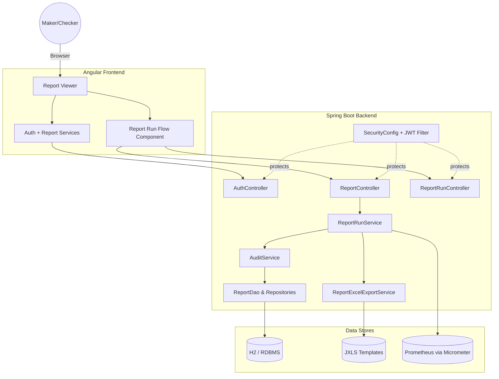
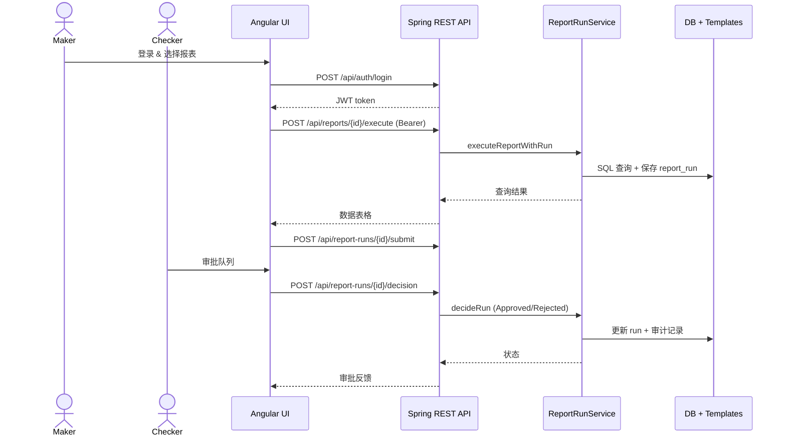
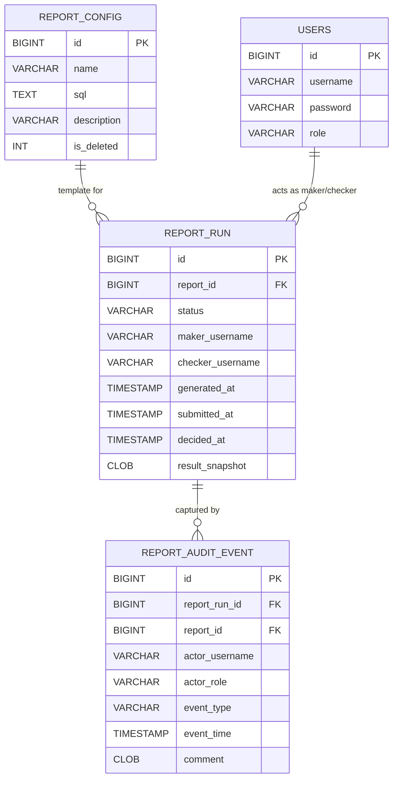

# System Architecture

> Angular 前端驱动 Maker/Checker 报表流程，Spring Boot 提供受 JWT 保护的 API、报表运行持久化与 Excel 导出，Micrometer 记录运营指标，H2 数据库承担默认存储。设计强调快速演示与可替换性：数据库、模板与监控均可无缝切换。

## System Diagram



## Tech Stack

| Component | Technology | Version | Role |
| --------- | ---------- | ------- | ---- |
| Frontend | Angular CLI | 17.3.x | SPA, Maker/Checker UI |
| Frontend Build | Node + npm | 18+ | Dev server & bundling |
| Backend | Spring Boot | 3.2.4 | REST API, security, services |
| Persistence | Spring Data JPA + JdbcTemplate | 3.2.x | ORM + raw SQL engine |
| Database | H2 (in-memory) | 2.x | Default demo data store |
| Security | Spring Security + JJWT | 6.x / 0.11.5 | JWT issuance & validation |
| Metrics | Micrometer + Prometheus registry | 1.12.x | Report run counters & timers |
| Export | JXLS + Apache POI | 2.14.0 | Excel templating |

## Data Flow



## Database Schema



## 目录结构（关键路径）

```text
hackathon-report-app/
├── backend/
│   ├── build.gradle
│   ├── src/main/java/com/legacy/report/
│   │   ├── controller/ (REST endpoints)
│   │   ├── service/ (Report, Run, Excel, Audit)
│   │   ├── security/ (JWT provider + filter)
│   │   └── repository/ (JPA interfaces)
│   └── src/main/resources/
│       ├── application.yml
│       ├── schema.sql & data.sql
│       └── report-templates/
├── frontend/
│   ├── package.json
│   └── src/app/
│       ├── components/ (report viewer, run flow)
│       └── services/ (auth/report)
└── wiki/
```

## 设计模式

| Pattern | Applied In | Purpose |
| ------- | ---------- | ------- |
| Controller-Service-Repository | `controller/*` → `service/*` → `repository/*` | 分层隔离 HTTP、业务与持久化逻辑。 |
| Builder (Micrometer & JWT) | `ReportRunService#setMeterRegistry`, `JwtTokenProvider` | 延迟注入第三方组件，集中配置指标/令牌。 |
| Template Rendering | `ReportExcelExportService#renderWithTemplate` | 通过 JXLS 模板复用导出布局，替换数据上下文。 |
| Strategy (Role checks) | `CurrentUserService#requireRole` | 通过角色字符串决定 Maker/Checker 行为。 |

## 安全风险摘要

| ID | Type | Location | Severity |
| -- | ---- | -------- | -------- |
| VUL-001 | SQL 注入 | `ReportService#runReport` / `ReportController#/reports/run` | 🔴 Critical |
| VUL-002 | 弱口令初始化 | `UserInitializer` 默认密码 123456 | 🟡 Medium |
| VUL-003 | 宽松 CORS + 无限来源 | `SecurityConfig#cors` | 🟡 Medium |
| VUL-004 | 缺少统一异常处理 | 非 `ReportExportException` | 🟢 Low |

> 详细修复方案见各模块文档的 **安全分析**。

## 相关文档

- [Index](index.md)
- [Doc Map](doc-map.md)
- [后端领域概览](后端/_index.md)
- [前端领域概览](前端/_index.md)
