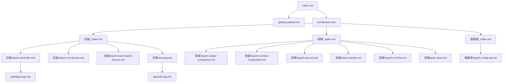

# Documentation Map

## Document Network

## Reading Paths

| Role | Start here | Then |
| ---- | ---------- | ---- |
| 新成员 | [Getting Started](getting-started.md) | [Index](index.md) → [Architecture](architecture.md) |
| 后端工程师 | [Architecture](architecture.md) | [后端/_index.md](后端/_index.md) → 模块文档 → API |
| 前端工程师 | [前端概览](前端/_index.md) | [api/report-api.md](api/report-api.md) → Angular services |
| 架构师 | [Architecture](architecture.md) | [Doc Map](doc-map.md) → 安全与模式章节 |
| 安全审计 | [后端/security.md](后端/security.md) | 各模块安全分析 → API 风险章节 |

## Full Index

| Document | Path | Last Updated |
| -------- | ---- | ------------ |
| Index | `wiki/index.md` | 2026-04-08 |
| Architecture | `wiki/architecture.md` | 2026-04-08 |
| Getting Started | `wiki/getting-started.md` | 2026-04-08 |
| Doc Map | `wiki/doc-map.md` | 2026-04-08 |
| 后端领域概览 | `wiki/后端/_index.md` | 2026-04-08 |
| 前端领域概览 | `wiki/前端/_index.md` | 2026-04-08 |
| Report Controller | `wiki/后端/report-controller.md` | 2026-04-08 |
| Report Run Controller | `wiki/后端/report-run-controller.md` | 2026-04-08 |
| Report Service | `wiki/后端/report-service.md` | 2026-04-08 |
| Report Run Service | `wiki/后端/report-run-service.md` | 2026-04-08 |
| Report Excel Export Service | `wiki/后端/report-excel-export-service.md` | 2026-04-08 |
| Security Layer | `wiki/后端/security.md` | 2026-04-08 |
| Report API | `wiki/api/report-api.md` | 2026-04-08 |
| Auth API | `wiki/api/auth-api.md` | 2026-04-08 |
| 数据库概览 | `wiki/数据库/_index.md` | 2026-04-08 |
| report_config SQL | `wiki/数据库/report-config-sql.md` | 2026-04-08 |
| ReportViewer 深入指南 | `wiki/前端/report-viewer.md` | 2026-04-08 |
| ReportRunFlow 审批视图 | `wiki/前端/report-run-flow.md` | 2026-04-08 |
| Auth Stack | `wiki/前端/auth-stack.md` | 2026-04-08 |

## 相关文档

- [Index](index.md)
- [Architecture](architecture.md)
- [后端领域概览](后端/_index.md)
- [前端领域概览](前端/_index.md)
