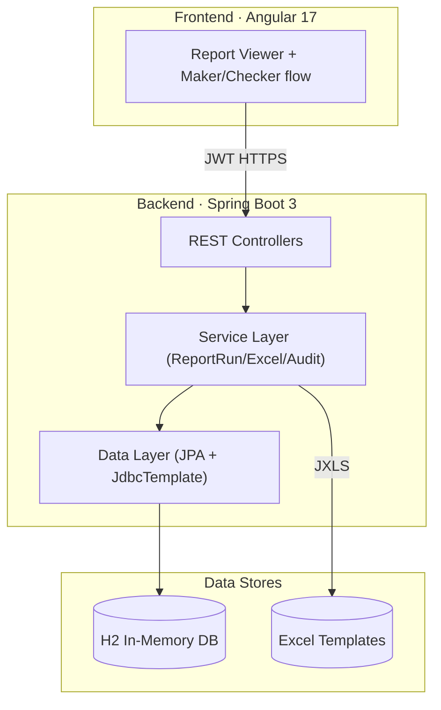

# Hackathon Report App

[](architecture.md) [](README.md) [](doc-map.md)

> 双栈（Angular + Spring Boot）报表治理平台，提供 Maker/Checker 审批流、SQL 报表执行与 Excel 导出。

系统将前端可视化与后端审计能力结合：前端负责动态报表配置与审批面板，后端提供 JWT 保护的 REST API、报表运行追踪、JXLS 导出与 Micrometer 监控。默认使用内存 H2，便于在 Hackathon 场景快速演示，也可替换为企业数据库。

---

## 架构预览



> 详细架构请见 [architecture.md](architecture.md)

---

## 文档导航

| Category | Document | Description |
| -------- | -------- | ----------- |
| 🚀 Start | [Getting Started](getting-started.md) | 搭建环境、运行与验证 |
| 🏗 Design | [Architecture](architecture.md) | 系统与数据流、技术栈 |
| 🧩 Backend | [后端领域概览](后端/_index.md) | 控制器 / 服务 / 安全模块 |
| 🎨 Frontend | [前端领域概览](前端/_index.md) | Angular 组件与服务 |
| 📖 API | [Report REST API](api/report-api.md) | 报表与运行接口说明 |
| 🔐 Auth API | [Auth REST API](api/auth-api.md) | 登录 / Profile 流程 |
| 🗺 Map | [Doc Map](doc-map.md) | 角色视角的阅读路径 |

---

## Quick Start

```bash
# 1. Backend - install & run
cd backend
./gradlew bootRun        # Windows 使用 .\gradlew.bat bootRun

# 2. Frontend - install & run
cd ../frontend
npm install
npm start                # http://localhost:4200

# 3. Verify health & login
curl http://localhost:8080/actuator/health
# 登录 admin/123456，Postman 调用 /api/auth/login 获取 JWT
```

---

## 模块概览

| Module | File | Responsibility |
| ------ | ---- | -------------- |
| ReportController | `backend/src/main/java/com/legacy/report/controller/ReportController.java` | 提供报表 CRUD、执行、导出入口（含存在风险的 SQL 直连接口）。 |
| ReportRunController | `backend/src/main/java/com/legacy/report/controller/ReportRunController.java` | 管理 Maker/Checker 流程、审批与运行审计。 |
| ReportService | `backend/src/main/java/com/legacy/report/service/ReportService.java` | 聚合 JdbcTemplate，负责报表元数据与 SQL 执行（当前存在注入隐患）。 |
| ReportRunService | `backend/src/main/java/com/legacy/report/service/ReportRunService.java` | 追踪报表运行、审批状态与 Micrometer 指标。 |
| ReportExcelExportService | `backend/src/main/java/com/legacy/report/service/ReportExcelExportService.java` | 基于 JXLS 模板生成 Excel，写入审计事件。 |
| Security Layer | `backend/src/main/java/com/legacy/report/security/*` | JWT 颁发、过滤器与 Spring Security 配置。 |
| Angular ReportService | `frontend/src/app/services/report.service.ts` | 前端访问 REST API、流转 Maker/Checker 数据。 |
| ReportViewerComponent | `frontend/src/app/components/report/report-viewer.component.ts` | 前端主操作台，涵盖执行、提交、审批与导出。 |
| ReportRunFlowComponent | `frontend/src/app/components/report/report-run-flow.component.ts` | 审计时间线视图，展示运行事件。 |

---

## 相关文档

- [Architecture](architecture.md)
- [Doc Map](doc-map.md)
- [后端领域概览](后端/_index.md)
- [前端领域概览](前端/_index.md)
- [数据库概览](数据库/_index.md)
