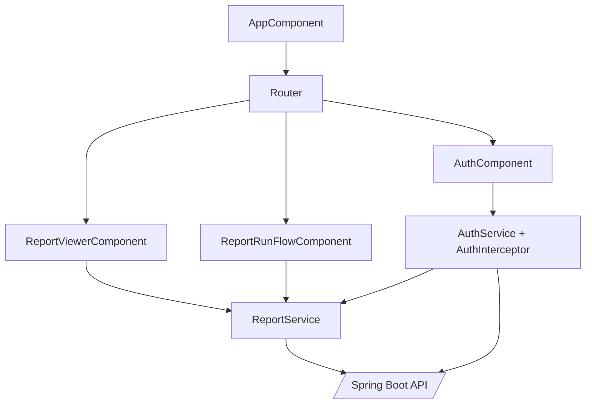

# 前端领域概览

## 概述

Angular 17 单页应用负责 Maker/Checker 的可视化操作：报表列表、SQL 结果表格、Maker 提交与 Checker 审批面板。核心由 `ReportViewerComponent` 展示执行数据，`ReportRunFlowComponent` 管理审批流程，`AuthService` + `AuthGuard` 维持登录状态并为 `ReportService` 注入 JWT。

## 组件架构

## 模块清单

| Element | Responsibility | Source |
| ------- | -------------- | ------ |
| `ReportViewerComponent` | 渲染报表查询、执行按钮、SQL 文本说明。 | `frontend/src/app/components/report/report-viewer.component.ts` |
| `ReportRunFlowComponent` | Maker 执行、提交，Checker 审批、查看历史。 | `frontend/src/app/components/report/report-run-flow.component.ts` |
| `AuthService` & `AuthInterceptor` | 登录、Token 缓存与 HTTP 拦截器自动注入 Bearer 头。 | `frontend/src/app/services/auth.*` |
| `ReportService` | 访问 `/api/reports` 与 `/api/report-runs`，提供 BehaviorSubject 缓存。 | `frontend/src/app/services/report.service.ts` |
| `AuthGuard` | 路由守卫，未登录跳转登录页。 | `frontend/src/app/services/auth.guard.ts` |

## 模块文档

- [ReportViewerComponent](report-viewer-component.md) — 主操作台与 Maker/Checker 交互说明。
- [ReportRunFlowComponent](report-run-flow-component.md) — 单个运行的审计时间线视图。
- [前端 ReportService](report-service.md) — API 封装及方法列表。

## 深入阅读

- [ReportViewer 深入指南](report-viewer.md) — 从 UI 分区、状态流、Maker/Checker 能力矩阵等角度解释交互体验。
- [ReportRunFlow 审批视图](report-run-flow.md) — 审计时间线的路由、模板与加载流程拆解。
- [Auth Stack](auth-stack.md) — 登录表单、AuthService、守卫与拦截器的整体架构。

## 数据交互

- 所有 API 调用指向 `http://localhost:8080/api`，可在 `report.service.ts` 修改以适配环境。
- `AuthInterceptor` 在 `localStorage` 读取 token 并添加到请求头，若 token 过期需重新登录。
- 组件通过 RxJS Observable 订阅服务流，视图自动刷新运行状态。

## 相关文档

- [Index](../index.md)
- [Architecture](../architecture.md)
- [Report API](../api/report-api.md)
- [后端领域概览](../后端/_index.md)
