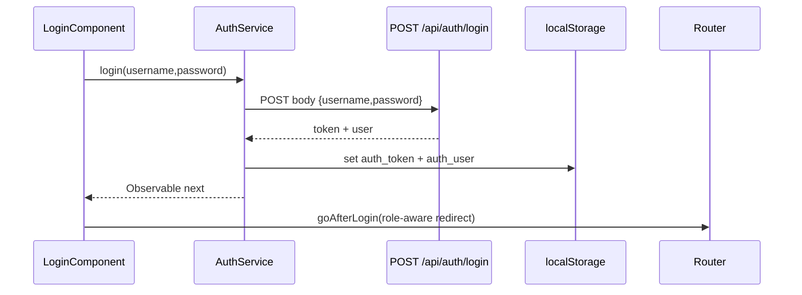
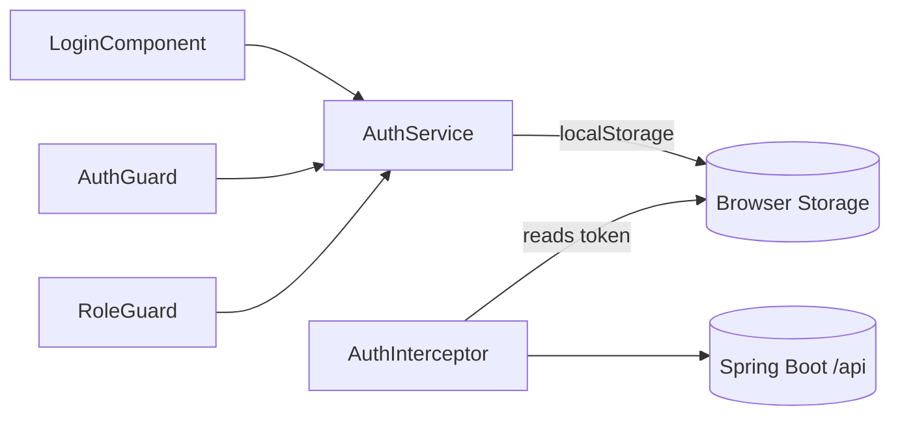

# Auth Stack（Login + AuthService + Guards）

## 概述

前端鉴权由四个独立构件组成：

1. `LoginComponent` 负责用户名/密码采集与登录后路由跳转。@frontend/src/app/components/auth/login.component.ts#1-124
2. `AuthService` 调用 `/api/auth/login` 保存 token 与用户信息，并提供 `isLoggedIn()` / `getCurrentUser()` 工具。@frontend/src/app/services/auth.service.ts#21-65
3. `authGuard` / `roleGuard` 保护路由，未登录跳转登录页或降级到 `/reports`。@frontend/src/app/services/auth.guard.ts#1-41
4. `authInterceptor` 为所有后端请求自动附加 `Authorization: Bearer <token>`。@frontend/src/app/services/auth.interceptor.ts#1-20

## 登录流程

- 登录表单仅在未登录时渲染；若已有 session，则直接展示当前用户与“进入系统”按钮。@frontend/src/app/components/auth/login.component.ts#15-38
- `goAfterLogin()` 根据角色决定默认跳转：CHECKER → `/checker`、MAKER → `/maker`，并尊重 `?redirect=` 参数。@frontend/src/app/components/auth/login.component.ts#111-122
- 所有错误通过 `loginError` 呈现，按钮受 `loggingIn` 控制以避免重复提交。@frontend/src/app/components/auth/login.component.ts#32-68 @frontend/src/app/components/auth/login.component.ts#96-108

## AuthService 能力

| 方法 | 描述 | Source |
| ---- | ---- | ------ |
| `login()` | 调用 `/api/auth/login` 并在 `tap` 中写入 token/user。 | @frontend/src/app/services/auth.service.ts#31-38 |
| `logout()` | 清除本地 token 与用户缓存。 | @frontend/src/app/services/auth.service.ts#41-44 |
| `getToken()` / `isLoggedIn()` | 供守卫与拦截器判定当前状态。 | @frontend/src/app/services/auth.service.ts#46-52 |
| `getCurrentUser()` | 解析本地 JSON，若解析失败返回 `null` 以防异常。 | @frontend/src/app/services/auth.service.ts#54-64 |

## 路由守卫

- `authGuard`：若缺少 token，则带着 `redirect=state.url` 参数跳转登录页，登录后可回到原路径。@frontend/src/app/services/auth.guard.ts#5-17
- `roleGuard`：读取路由 `data.roles`，比对 `user.role` 字符串（如 `MAKER,CHECKER`），不符合则导航到 `/reports`。@frontend/src/app/services/auth.guard.ts#20-41

该模式允许 Maker/Checker 共用一个 SPA，但通过守卫控制访问 Maker 面板（`roles: ['MAKER']`）或 Checker 面板。

## HTTP 拦截器

- 仅当请求 URL 以 `http://localhost:8080/api` 开头时才添加 `Authorization` 头，避免对静态资源或第三方 API 造成污染。@frontend/src/app/services/auth.interceptor.ts#6-18
- token 直接来自 `localStorage`，与 `AuthService` 使用同一 key，保证单一来源。

## 依赖关系

## 与业务组件的集成

- `ReportViewerComponent` 在模板中直接调用 `authService.isLoggedIn()`、`getCurrentUser()` 来按角色渲染 Maker/Checker 面板。@frontend/src/app/components/report/report-viewer.component.html#4-241
- `report.service.ts` 不需要显式注入 token，因为拦截器会统一处理。@frontend/src/app/services/report.service.ts#45-120

## 相关文档

- [ReportViewerComponent](report-viewer.md)
- [ReportRunFlowComponent](report-run-flow.md)
- [Auth REST API](../api/auth-api.md)
