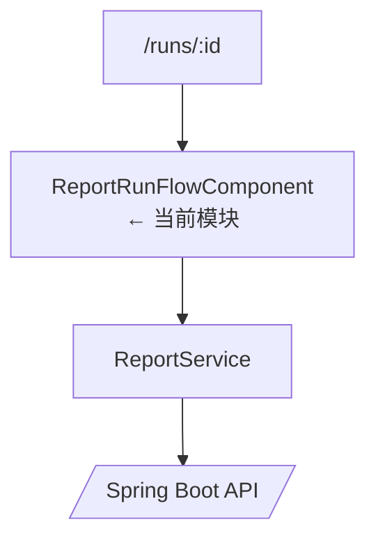
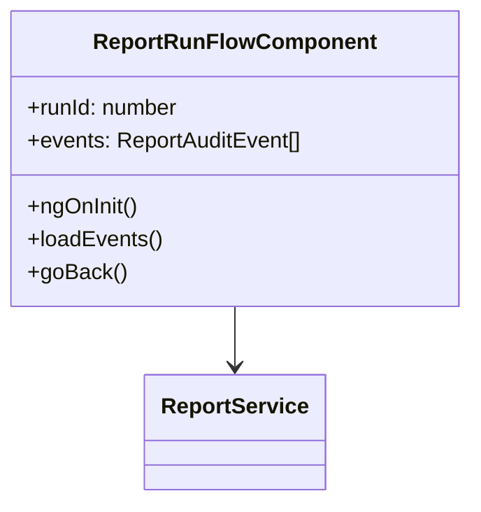

# ReportRunFlowComponent

## 概述

`ReportRunFlowComponent` 是一个独立路由页面，用于展示指定 `report_run` 的完整审计时间线。它通过路由参数获取 `runId`，调用 `ReportService.getAuditTrail` 并以时间线样式展示事件。

## 架构位置

## 类图

## 方法详解

### `ngOnInit()`

从 `ActivatedRoute` 读取 `id` 参数，校验后保存到 `runId` 并触发 `loadEvents()`。Source: [📄](file://c:/Users/Administrator/Downloads/hackathon-report-app/frontend/src/app/components/report/report-run-flow.component.ts#L99-L107)

### `loadEvents()`

设置 `loading` 状态并调用 `ReportService.getAuditTrail(runId)`，成功后填充 `events`，失败则设置 `error`。Source: [📄](file://c:/Users/Administrator/Downloads/hackathon-report-app/frontend/src/app/components/report/report-run-flow.component.ts#L109-L122)

### `goBack()`

使用 `Router` 返回 `/reports` 主界面。Source: [📄](file://c:/Users/Administrator/Downloads/hackathon-report-app/frontend/src/app/components/report/report-run-flow.component.ts#L124-L126)

## 安全分析

| ID | 类型 | 位置 | 严重程度 | 修复方案 |
| -- | ---- | ---- | -------- | ------- |
| VUL-FE-003 | 路由参数未校验 | 仅进行 `Number()` 转换 | 🟢 低 | 在展示前校验 `runId > 0`，错误时跳回列表。 |

## 相关文档

- [前端领域概览](./_index.md)
- [ReportViewerComponent](report-viewer-component.md)
- [前端 ReportService](report-service.md)
- [后端 ReportRunController](../后端/report-run-controller.md)
