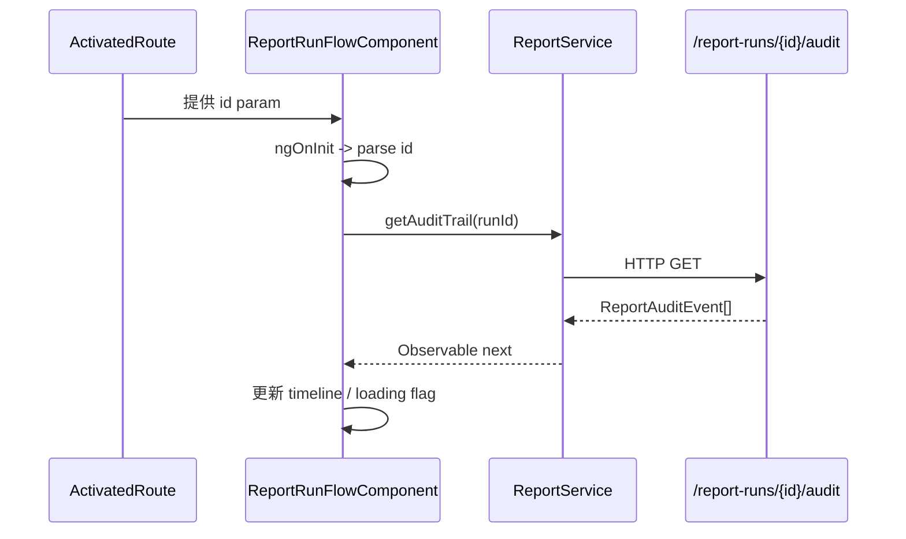

# ReportRunFlowComponent

## 概述

`ReportRunFlowComponent` 以时间轴展示单次报表运行的完整审批轨迹，主要面向想要追查审计事件的 Maker/Checker。组件依赖路由参数 `id`、`ReportService#getAuditTrail()`、以及轻量的内联模板样式组成一个独立页面。@frontend/src/app/components/report/report-run-flow.component.ts#1-128

## 路由与依赖

- 通过 `app.routes.ts` 中的 `/runs/:id/flow` 路由暴露，通常由 `ReportViewerComponent` 的“查看完整审批流程”按钮导航。@frontend/src/app/components/report/report-viewer.component.html#85-235
- 构造函数注入 `ActivatedRoute`、`Router` 与 `ReportService`，其中 route 用于解析 `runId`，router 提供返回 `/reports` 的导航。@frontend/src/app/components/report/report-run-flow.component.ts#93-126
- 仅依赖 `CommonModule`，可作为 Standalone 组件被直接 lazy load。@frontend/src/app/components/report/report-run-flow.component.ts#6-10

## 渲染流程

- `ngOnInit` 在缺少 `runId` 时直接设置错误状态并终止后续加载，防止空请求。@frontend/src/app/components/report/report-run-flow.component.ts#99-107
- `loadEvents()` 负责切换 `loading`、清空上一次错误并订阅审计结果，错误场景中会带上后端的 message。@frontend/src/app/components/report/report-run-flow.component.ts#109-122

## 模板要点

| 元素 | 说明 | Source |
| ---- | ---- | ------ |
| `.flow-container` | 主框体 + 返回按钮 + 标题。 | @frontend/src/app/components/report/report-run-flow.component.ts#10-33 |
| `.timeline` | 自定义垂直时间线，使用 `*ngFor` 展示每条事件的时间、类型、操作者与备注。 | @frontend/src/app/components/report/report-run-flow.component.ts#19-31 |
| 空状态与错误 | `events.length === 0` 时显示“暂无审计记录”，`error` 字段用于渲染红色提示。 | @frontend/src/app/components/report/report-run-flow.component.ts#15-36 |
| Loading | 通过 `loading` flag 展示“加载审批流程中...”。 | @frontend/src/app/components/report/report-run-flow.component.ts#34-35 |

## UX / 导航

- 「返回」按钮统一回到 `/reports`，便于用户从历史详情回到工作台。@frontend/src/app/components/report/report-run-flow.component.ts#12-13 @frontend/src/app/components/report/report-run-flow.component.ts#124-126
- 时间格式使用 `date:'yyyy-MM-dd HH:mm:ss'`，与主面板保持一致，减少审计人员切换成本。@frontend/src/app/components/report/report-run-flow.component.ts#21-22
- 组件不负责权限校验，依赖上游路由守卫保证只有登录用户才能访问。详见 [Auth Stack](auth-stack.md).

## 相关文档

- [ReportViewerComponent](report-viewer.md)
- [Report REST API](../api/report-api.md)
