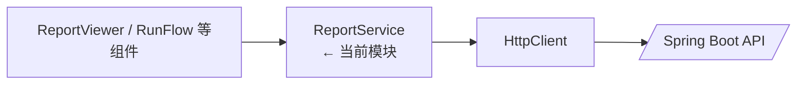
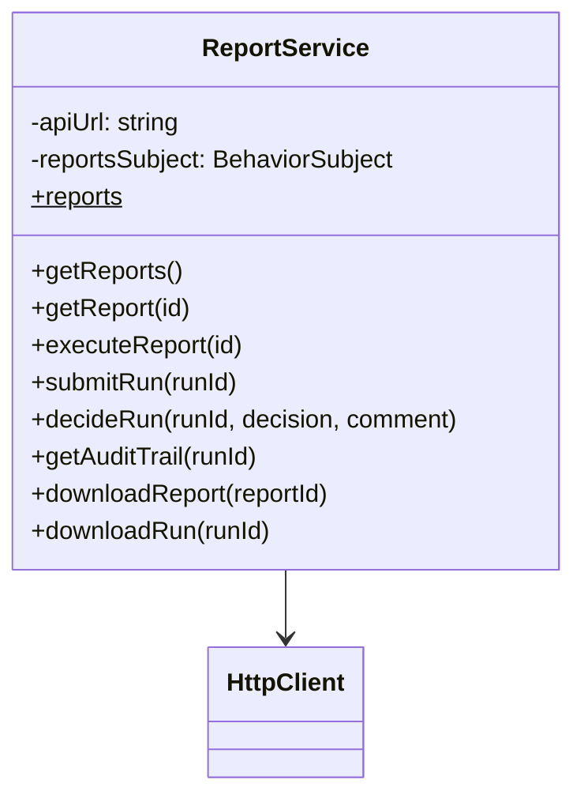

# 前端 ReportService

## 概述

`ReportService` 是 Angular 前端访问后端报表与运行 API 的集中服务，封装所有 `/api/reports*` 与 `/api/report-runs*` 请求，并暴露类型化接口供组件消费。它还维护一个 `BehaviorSubject` 用于缓存在前端获取的报表列表。

## 架构位置

## 类图

## 方法详解

### `getReports()` / `getReport(id)`

分别调用 `GET /reports`、`GET /reports/{id}`，返回 `Observable<Report[]>` 与 `Observable<Report>`。Source: [📄](file://c:/Users/Administrator/Downloads/hackathon-report-app/frontend/src/app/services/report.service.ts#L52-L58)

### `executeReport(id: number)`

向 `/reports/{id}/execute` 发送 POST 请求并返回 `Observable<any[]>`，供 ReportViewer 执行模板报表。Source: [📄](file://c:/Users/Administrator/Downloads/hackathon-report-app/frontend/src/app/services/report.service.ts#L60-L63)

### `getMyRuns()` / `getSubmittedRuns()` / `getCheckerHistoryRuns()`

Maker & Checker 视图对应的列表数据，分别命中 `/report-runs/my-runs`、`/submitted`、`/checker/history`。Source: [📄](file://c:/Users/Administrator/Downloads/hackathon-report-app/frontend/src/app/services/report.service.ts#L83-L93)

### `submitRun(runId)`

POST `/report-runs/{id}/submit`，返回 `Observable<void>` 并由前端决定提示文案。Source: [📄](file://c:/Users/Administrator/Downloads/hackathon-report-app/frontend/src/app/services/report.service.ts#L95-L97)

### `decideRun(runId, decision, comment)`

Checker 审批接口，Post body 带 decision/comment。Source: [📄](file://c:/Users/Administrator/Downloads/hackathon-report-app/frontend/src/app/services/report.service.ts#L99-L104)

### `getAuditTrail(runId)`

`GET /report-runs/{id}/audit` 返回审计事件数组，供当前运行与审批历史展示。Source: [📄](file://c:/Users/Administrator/Downloads/hackathon-report-app/frontend/src/app/services/report.service.ts#L106-L108)

### `downloadReport(reportId)` / `downloadRun(runId)`

以 `responseType: 'blob'` 下载 Excel 文件。Source: [📄](file://c:/Users/Administrator/Downloads/hackathon-report-app/frontend/src/app/services/report.service.ts#L110-L120)

## 安全分析

| ID | 类型 | 位置 | 严重程度 | 修复方案 |
| -- | ---- | ---- | -------- | ------- |
| VUL-FE-004 | API base URL 写死 | `apiUrl = 'http://localhost:8080/api'` | 🟡 中 | 改为注入环境变量，避免构建后难以切换环境。 |
| VUL-FE-005 | 缺少错误处理 | 大部分方法直接返回 Observable | 🟢 低 | 在调用处统一 `catchError` 或在服务层包装错误信息。 |

## 相关文档

- [前端领域概览](./_index.md)
- [ReportViewerComponent](report-viewer-component.md)
- [ReportRunFlowComponent](report-run-flow-component.md)
- [后端 Report API](../api/report-api.md)
