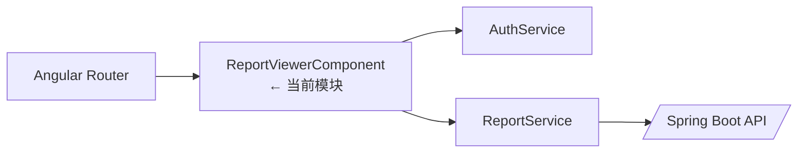
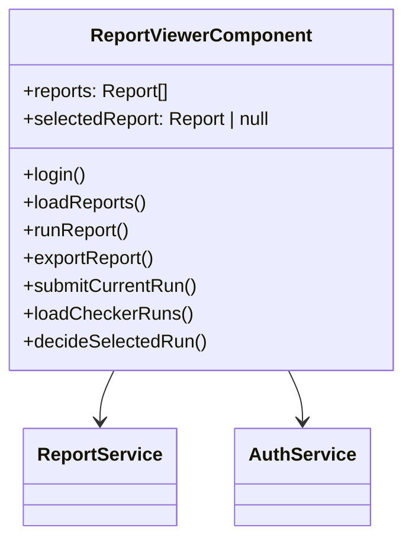

# ReportViewerComponent

## 概述

`ReportViewerComponent` 是前端的主工作台，负责展示报表列表、执行 SQL、触发 Excel 导出，并在同一界面支持 Maker 运行提交与 Checker 审批。组件通过 `ReportService` 与后端交互，并借助 `AuthService` 管理登录态。

## 架构位置

## 类图

## 方法详解

### `login()`

调用 `AuthService.login` 获取 JWT，并在成功后批量加载报表与 Maker/Checker 数据。Source: [📄](file://c:/Users/Administrator/Downloads/hackathon-report-app/frontend/src/app/components/report/report-viewer.component.ts#L119-L135)

### `loadReports()`

订阅 `ReportService.getReports` 并填充 `reports`，失败时在 `error` 中显示消息。Source: [📄](file://c:/Users/Administrator/Downloads/hackathon-report-app/frontend/src/app/components/report/report-viewer.component.ts#L325-L334)

### `runReport()`

针对当前选中报表调用 `ReportService.executeReport`，将返回的 `any[]` 保存为 `reportData` 并刷新当前运行记录。Source: [📄](file://c:/Users/Administrator/Downloads/hackathon-report-app/frontend/src/app/components/report/report-viewer.component.ts#L348-L363)

### `exportReport()` / `exportCurrentRun()`

分别导出模板报表与特定运行，通过 `ReportService.downloadReport` / `downloadRun` 得到 Blob 并调用 `triggerDownload` 保存。Source: [📄](file://c:/Users/Administrator/Downloads/hackathon-report-app/frontend/src/app/components/report/report-viewer.component.ts#L366-L397)

### `submitCurrentRun()`

在 Maker 视角下将 `Generated` 运行提交以进入审批队列。Source: [📄](file://c:/Users/Administrator/Downloads/hackathon-report-app/frontend/src/app/components/report/report-viewer.component.ts#L194-L209)

### `loadCheckerRuns()` / `decideSelectedRun()`

Checker 列表与审批动作，分别调用 `ReportService.getSubmittedRuns` 和 `decideRun`，并维护 `checkerRuns`、`checkerAudit` 等 UI 状态。Source: [📄](file://c:/Users/Administrator/Downloads/hackathon-report-app/frontend/src/app/components/report/report-viewer.component.ts#L219-L293)

## 安全分析

| ID | 类型 | 位置 | 严重程度 | 修复方案 |
| -- | ---- | ---- | -------- | ------- |
| VUL-FE-001 | 默认凭据硬编码 | `username/password` 初始化为 admin/123456 | 🟡 中 | 仅在开发环境展示默认值，生产中改为输入占位符或从配置读取。 |
| VUL-FE-002 | 错误信息直传 | 多处将 `err.message` 直接显示给用户 | 🟢 低 | 统一映射为用户友好的错误提示，避免泄露堆栈。 |

## 相关文档

- [前端领域概览](./_index.md)
- [ReportRunFlowComponent](report-run-flow-component.md)
- [前端 ReportService](report-service.md)
- [后端 Report API](../api/report-api.md)
