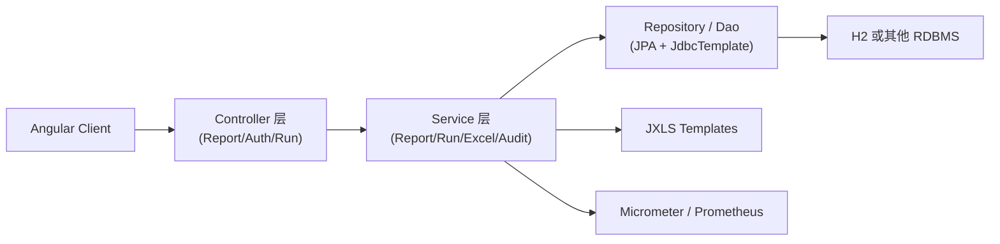

# 后端领域概览

## 概述

Spring Boot 3 后端通过典型的 Controller → Service → Repository 分层实现报表执行、运行追踪、审计导出与安全控制。控制器暴露 `/api/**` REST 接口，服务层封装 Maker/Checker 流程与 JXLS 导出逻辑，Repository 层混合 JPA 与 JdbcTemplate，以兼顾报表配置与运行历史的读写性能。

## 分层架构

## 模块清单

| Module | Description | Key Files |
| ------ | ----------- | --------- |
| ReportController | 报表 CRUD、执行、导出入口，直接连接 ReportService 与 ReportRunService。 | [`report-controller.md`](report-controller.md) |
| ReportRunController | Maker/Checker 审批接口、审计历史与导出。 | [`report-run-controller.md`](report-run-controller.md) |
| AuthController | 登录、Profile、Logout；依赖 AuthService 与 JWT。 | [`security.md`](security.md#authcontroller) |
| ReportService | 报表元数据、SQL 执行与生成报表；当前包含 SQL 注入风险。 | [`report-service.md`](report-service.md) |
| ReportRunService | 运行生命周期、审批校验、审计记录与指标。 | [`report-run-service.md`](report-run-service.md) |
| ReportExcelExportService | 基于 JXLS 的模板导出、快照回放。 | [`report-excel-export-service.md`](report-excel-export-service.md) |
| Security Layer | SecurityConfig、JwtTokenProvider、JwtAuthenticationFilter、CurrentUserService。 | [`security.md`](security.md) |

## 数据接口

- **外部输入**：Angular 前端、Postman 脚本等通过 JWT + Bearer Header 调用 `/api/**`。
- **内部输出**：Micrometer 指标、Excel 二进制流、审计日志（`report_audit_event`）。

## 相关文档

- [Architecture](../architecture.md)
- [Report API](../api/report-api.md)
- [Auth API](../api/auth-api.md)
- [Doc Map](../doc-map.md)
