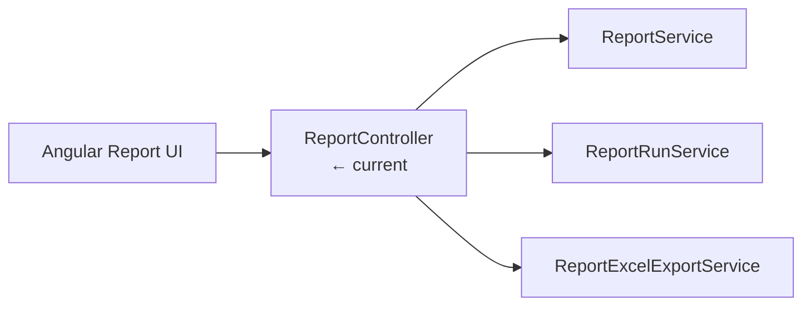
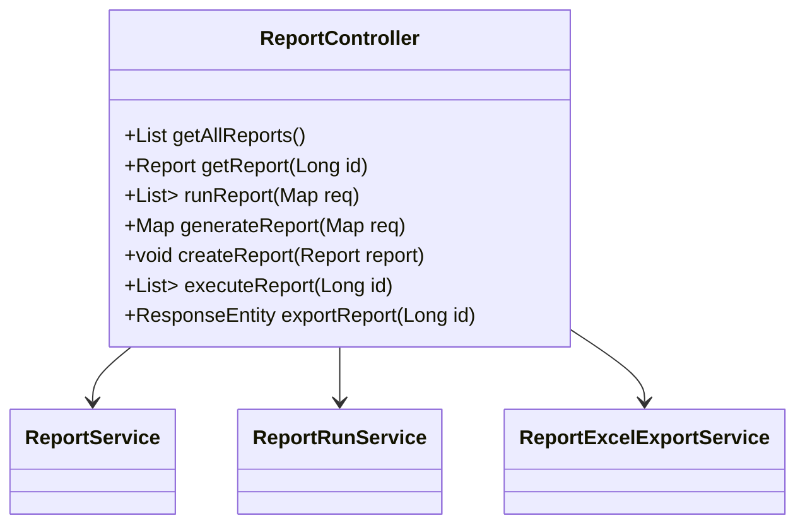

# ReportController

## 概述

`ReportController` 暴露 `/api/reports`、`/api/report-runs` 等 REST 入口，协调 `ReportService`、`ReportRunService` 与 `ReportExcelExportService` 完成报表查询、SQL 执行、Excel 导出。为了兼容 Hackathon 原型，控制器允许直接传入 SQL，导致潜在注入风险，是安全加固的重点位置。

## 架构位置



## 类图



## 方法详解

### `getAllReports()`

返回所有 `report_config` 记录，直接调用 `ReportService#getAllReports`。Source: [📄](file://c:/Users/Administrator/Downloads/hackathon-report-app/backend/src/main/java/com/legacy/report/controller/ReportController.java#L54-L58)

```http
GET /api/reports HTTP/1.1
Authorization: Bearer <token>
```

### `runReport(Map<String,String> request)`

执行任意 SQL 并返回结果列表。缺乏参数校验，是 VUL-001 的入口。Source: [📄](file://c:/Users/Administrator/Downloads/hackathon-report-app/backend/src/main/java/com/legacy/report/controller/ReportController.java#L65-L70)

```http
POST /api/reports/run
Content-Type: application/json

{"sql":"SELECT * FROM customer"}
```

```http
# 错误示例：用户可拼接恶意 SQL
POST /api/reports/run
{"sql":"SELECT * FROM users; DROP TABLE users;"}
```

### `generateReport(Map<String,Object> request)`

根据 reportId 抓取模板 SQL，拼接 `params` 后执行。Source: [📄](file://c:/Users/Administrator/Downloads/hackathon-report-app/backend/src/main/java/com/legacy/report/controller/ReportController.java#L72-L77)

```json
{
  "reportId": 1,
  "params": "customer_id = 10086"
}
```

### `executeReport(Long id)`

通过 `ReportRunService#executeReportWithRun` 生成运行记录并返回结果。Source: [📄](file://c:/Users/Administrator/Downloads/hackathon-report-app/backend/src/main/java/com/legacy/report/controller/ReportController.java#L84-L89)

### `exportReport(Long id)`

调用 `ReportExcelExportService#exportLatestByReportId`，以 `Content-Disposition` 附件形式输出。Source: [📄](file://c:/Users/Administrator/Downloads/hackathon-report-app/backend/src/main/java/com/legacy/report/controller/ReportController.java#L91-L103)

```http
GET /api/reports/12/export
Accept: application/vnd.openxmlformats-officedocument.spreadsheetml.sheet
```

## 安全分析

| ID | 类型 | 位置 | 严重程度 | 修复方案 |
| -- | ---- | ---- | -------- | ------- |
| VUL-001 | SQL 注入 | `/reports/run` + `/reports/generate` | 🔴 严重 | 禁用原始 SQL 接口，或使用参数化查询/白名单模板。 |
| VUL-002 | 缺少响应封装 | `/reports` 返回实体导致字段暴露 | 🟢 低 | 引入 DTO 并过滤 `sql` 字段或加密存储。 |

## 相关文档

- [后端领域概览](./_index.md)
- [ReportService](report-service.md)
- [ReportRunService](report-run-service.md)
- [Report Excel Export Service](report-excel-export-service.md)
- [Report API](../api/report-api.md)
