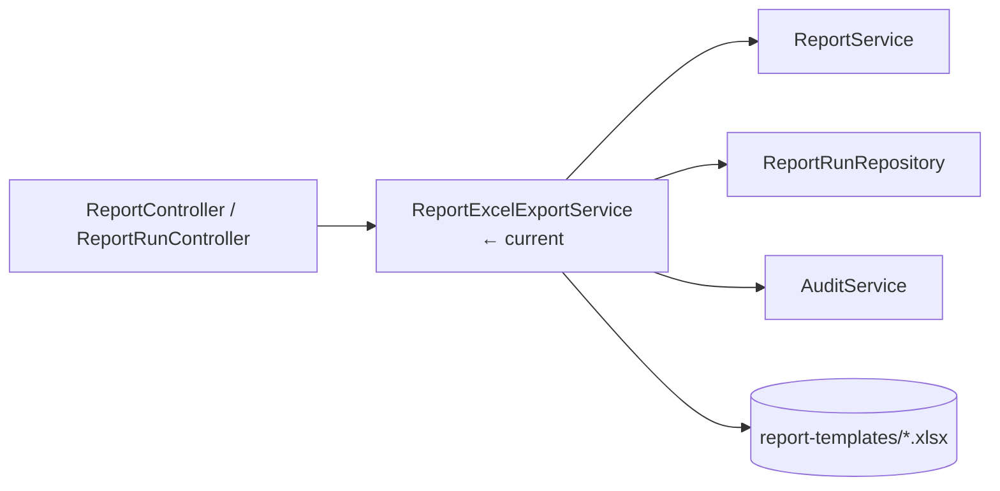
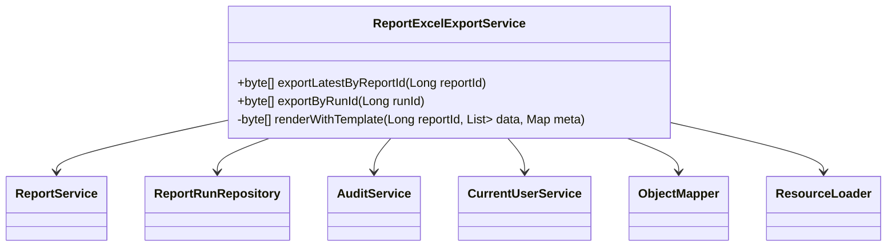

# ReportExcelExportService

## 概述

`ReportExcelExportService` 负责把运行结果渲染为 Excel，支持“最新报表导出”与“按运行导出”两种模式。它读取存储在资源目录的 JXLS 模板，根据 Report/Run 元数据构造上下文，输出 `byte[]` 并记录审计事件。

## 架构位置



## 类图



## 方法详解

### `exportLatestByReportId(Long reportId)`

1. 校验当前用户具备 `MAKER` 角色。  
2. 读取报告模板与 SQL 数据。  
3. 生成 `meta` 字典并调用 `renderWithTemplate`。  
4. 记录 `ExportedLatest` 审计事件。  
Source: [📄](file://c:/Users/Administrator/Downloads/hackathon-report-app/backend/src/main/java/com/legacy/report/service/ReportExcelExportService.java#L54-L81)

### `exportByRunId(Long runId)`

- 加载运行快照；如 JSON 解析失败则回退到重新执行 SQL。  
- 生成包含 `runId`、`status` 的 meta。  
- 记录 `ExportedRun` 审计事件。  
Source: [📄](file://c:/Users/Administrator/Downloads/hackathon-report-app/backend/src/main/java/com/legacy/report/service/ReportExcelExportService.java#L83-L126)

```java
byte[] bytes = reportExcelExportService.exportByRunId(42L);
Files.write(Path.of("run-42.xlsx"), bytes);
```

```java
// 边界：模板缺失
try {
    reportExcelExportService.exportLatestByReportId(5L);
} catch(ReportExportException ex) {
    // Template not found
}
```

### `renderWithTemplate(Long reportId, List<Map<String,Object>> data, Map<String,Object> meta)`

封装 JXLS 渲染逻辑，封面控制台：

- 依据 `report-{id}.xlsx` 定位模板。  
- 提供 `data` / `meta` 到上下文。  
- 捕获 `IOException` 并转化为 `ReportExportException`。  
Source: [📄](file://c:/Users/Administrator/Downloads/hackathon-report-app/backend/src/main/java/com/legacy/report/service/ReportExcelExportService.java#L128-L155)

## 安全分析

| ID | 类型 | 位置 | 严重程度 | 修复方案 |
| -- | ---- | ---- | -------- | ------- |
| VUL-012 | 模板路径注入 | `renderWithTemplate` 拼接 `reportId` 无白名单 | 🟢 低 | 使用 `PathMatcher` 限制模板命名或将模板映射存放数据库。 |
| VUL-013 | JSON 快照泄露 | `exportByRunId` 在解析失败时重新执行 SQL，可能暴露实时敏感数据 | 🟡 中 | 优先信任快照，并在回退前检查运行状态及权限。 |
| VUL-014 | Audit 缺少上下文 | 审计事件没有记录导出 IP | 🟢 低 | 在 `AuditService` 添加来源信息。 |

## 相关文档

- [ReportController](report-controller.md)
- [ReportRunController](report-run-controller.md)
- [ReportRunService](report-run-service.md)
- [Security Layer](security.md)
- [Report API](../api/report-api.md)
