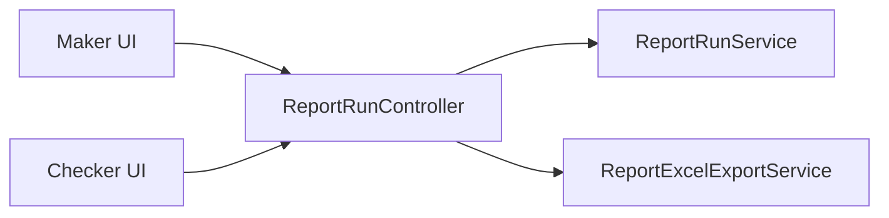
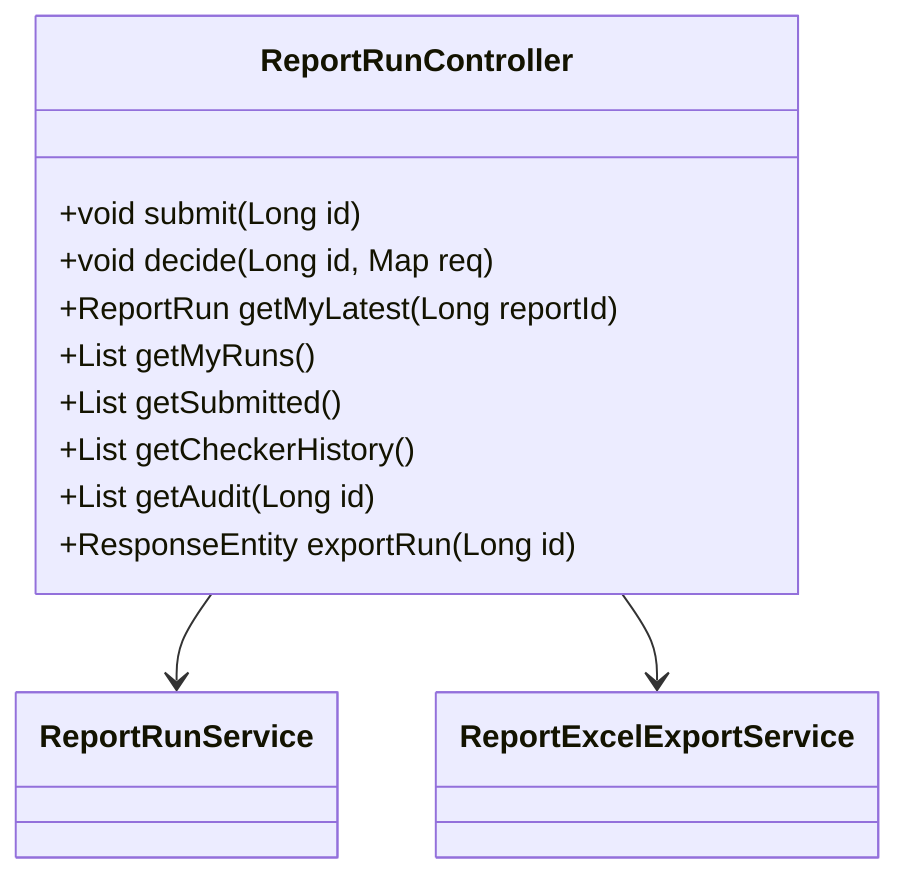

# ReportRunController

## 概述

`ReportRunController` 以 `/api/report-runs` 路由暴露 Maker 提交、Checker 审批、审计查询与 Excel 导出接口。它把权限控制交给 `ReportRunService` 与 `CurrentUserService`，自身侧重输入验证与路由分发。

## 架构位置



## 类图



## 方法详解

### `submit(Long id)`

Maker 调用 POST `/report-runs/{id}/submit`，委托 `ReportRunService#submitRun` 校验状态与归属。Source: [📄](file://c:/Users/Administrator/Downloads/hackathon-report-app/backend/src/main/java/com/legacy/report/controller/ReportRunController.java#L28-L31)

### `decide(Long id, Map<String,String> request)`

Checker 审批接口，解析 `decision` / `comment` 并调用 `decideRun`。Source: [📄](file://c:/Users/Administrator/Downloads/hackathon-report-app/backend/src/main/java/com/legacy/report/controller/ReportRunController.java#L33-L52)

```http
POST /api/report-runs/10/decision
{
  "decision": "APPROVED",
  "comment": "数据与账单一致"
}
```

```http
# 错误：decision 缺失
HTTP/1.1 500 RuntimeException: decision 字段必填
```

### `getMyLatest(Long reportId)`

返回当前 Maker 在指定报表的最近一次运行。Source: [📄](file://c:/Users/Administrator/Downloads/hackathon-report-app/backend/src/main/java/com/legacy/report/controller/ReportRunController.java#L54-L57)

### `getSubmitted()` / `getCheckerHistory()`

面向 Checker，分别列出待审与历史记录。Source: [📄](file://c:/Users/Administrator/Downloads/hackathon-report-app/backend/src/main/java/com/legacy/report/controller/ReportRunController.java#L64-L72)

### `getAudit(Long id)`

读取运行对应的审计轨迹。Source: [📄](file://c:/Users/Administrator/Downloads/hackathon-report-app/backend/src/main/java/com/legacy/report/controller/ReportRunController.java#L74-L77)

### `exportRun(Long id)`

重用 Excel 服务导出特定运行实例。Source: [📄](file://c:/Users/Administrator/Downloads/hackathon-report-app/backend/src/main/java/com/legacy/report/controller/ReportRunController.java#L79-L87)

## 安全分析

| ID | 类型 | 位置 | 严重程度 | 修复方案 |
| -- | ---- | ---- | -------- | ------- |
| VUL-005 | 运行状态硬编码 | `submit` 仅允许 `Generated`，但通过 API 仍可暴力枚举 runId | 🟡 中 | 在 `ReportRunService` 中增加对 `reportId` + 当前用户组合的速率限制与审计。 |
| VUL-006 | 错误暴露 | 缺少异常处理导致 RuntimeException 直接抛给前端 | 🟢 低 | 使用 `@ControllerAdvice` 拦截，返回结构化错误码。 |

## 相关文档

- [ReportRunService](report-run-service.md)
- [Report Excel Export Service](report-excel-export-service.md)
- [Security Layer](security.md)
- [Report API](../api/report-api.md)
- [后端领域概览](./_index.md)
