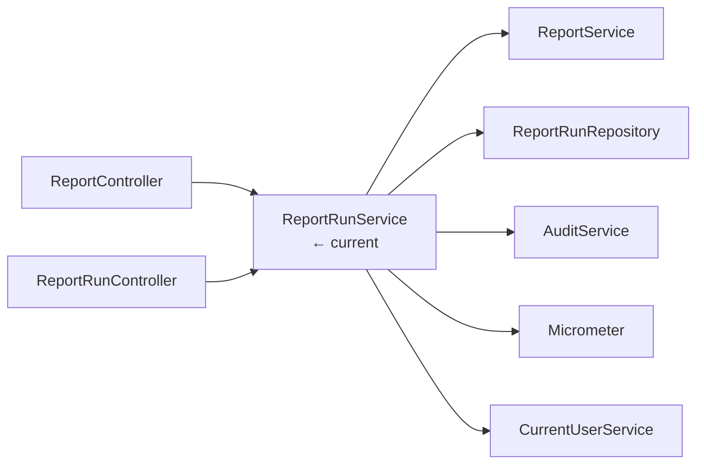
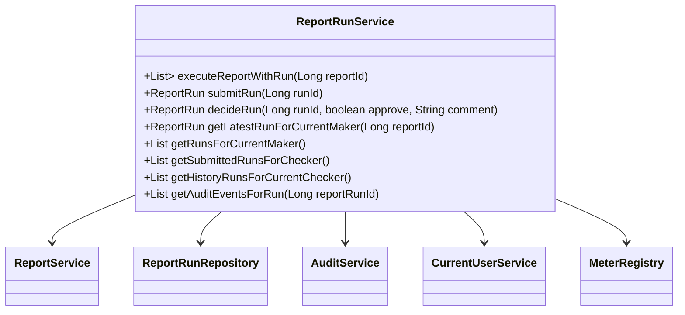

# ReportRunService

## 概述

`ReportRunService` 负责整个 Maker/Checker 生命周期：生成运行记录、提交审批、做出决策、记录审计、同步 Micrometer 指标，并提供各角色的运行视图。它在业务层组合 `ReportService`、`ReportRunRepository`、`AuditService` 与 `CurrentUserService`，确保角色校验与状态机一致性。

## 架构位置



## 类图



## 方法详解

### `executeReportWithRun(Long reportId)`

1. 获取当前用户并校验 `MAKER`。  
2. 调用 `ReportService#runReport` 执行 SQL。  
3. 生成 `ReportRun` 实体，保存 JSON 快照。  
4. 记录 `Generated` 审计事件与指标。  
Source: [📄](file://c:/Users/Administrator/Downloads/hackathon-report-app/backend/src/main/java/com/legacy/report/service/ReportRunService.java#L75-L128)

```java
List<Map<String,Object>> rows = reportRunService.executeReportWithRun(3L);
```

### `submitRun(Long runId)`

校验当前用户为 Maker 且 run 状态为 `Generated`，然后更新为 `Submitted`。Source: [📄](file://c:/Users/Administrator/Downloads/hackathon-report-app/backend/src/main/java/com/legacy/report/service/ReportRunService.java#L130-L168)

### `decideRun(Long runId, boolean approve, String comment)`

- 要求角色为 `CHECKER`。  
- 仅允许 `Submitted` 状态。  
- 审批拒绝时 comment 必填。  
- 更新状态 + `approvalDurationTimer`。  
Source: [📄](file://c:/Users/Administrator/Downloads/hackathon-report-app/backend/src/main/java/com/legacy/report/service/ReportRunService.java#L170-L225)

### `getLatestRunForCurrentMaker(Long reportId)`

返回当前 Maker 最近一次执行记录，否则抛出异常。Source: [📄](file://c:/Users/Administrator/Downloads/hackathon-report-app/backend/src/main/java/com/legacy/report/service/ReportRunService.java#L227-L239)

### `getAuditEventsForRun(Long reportRunId)`

只要已登录即可查看指定运行的完整审计轨迹。Source: [📄](file://c:/Users/Administrator/Downloads/hackathon-report-app/backend/src/main/java/com/legacy/report/service/ReportRunService.java#L262-L266)

## 安全分析

| ID | 类型 | 位置 | 严重程度 | 修复方案 |
| -- | ---- | ---- | -------- | ------- |
| VUL-009 | 角色硬编码 | `requireRole("MAKER")` / `"CHECKER"` 依赖字符串 | 🟡 中 | 将角色改为 Enum + @PreAuthorize，避免拼写错误导致绕过。 |
| VUL-010 | 审计绕过 | `getAuditEventsForRun` 只要求登录 | 🟠 高 | 复用 Maker/Checker 权限或按 `reportId` 粒度控制。 |
| VUL-011 | JSON 快照潜在信息泄露 | `resultSnapshot` 存储原始数据 | 🟢 低 | 对敏感列遮蔽或使用加密存储。 |

## 相关文档

- [ReportRunController](report-run-controller.md)
- [ReportController](report-controller.md)
- [Report Excel Export Service](report-excel-export-service.md)
- [Security Layer](security.md)
- [Doc Map](../doc-map.md)
