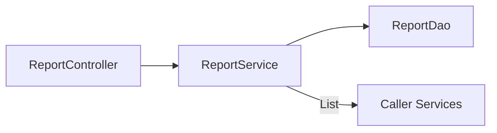
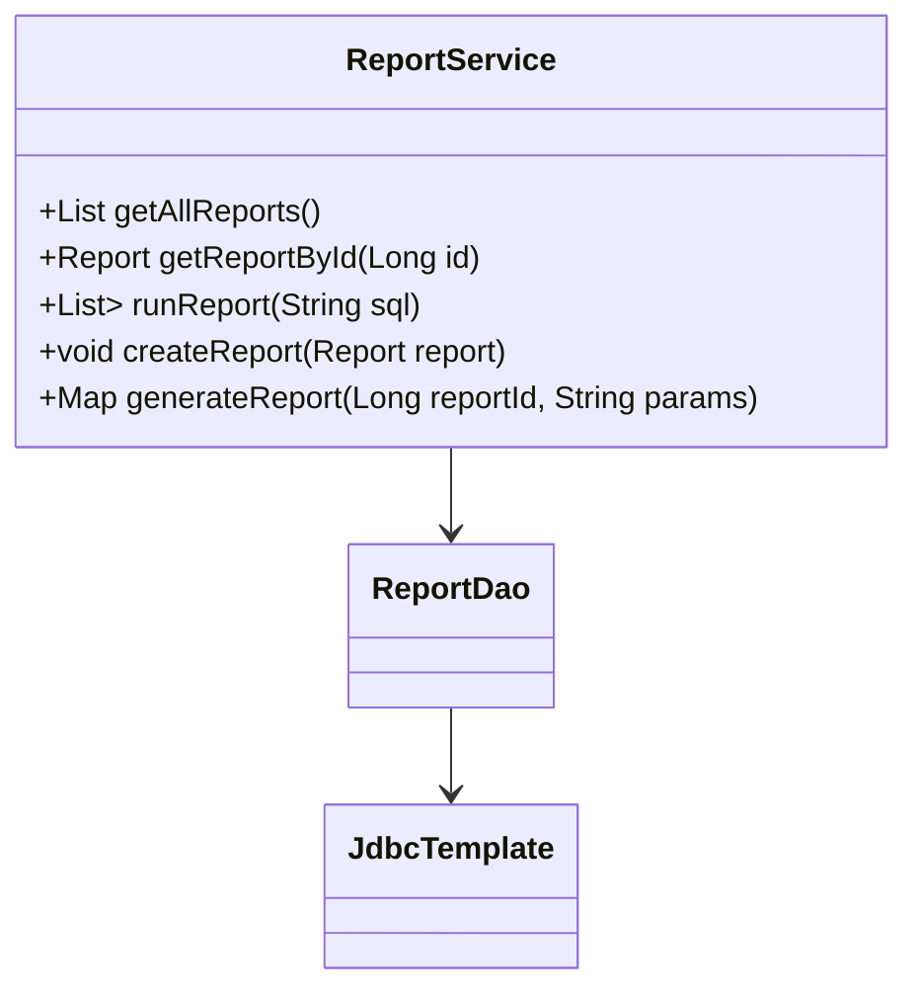

# ReportService

## 概述

`ReportService` 封装报表元数据查询、任意 SQL 执行、报表创建与生成逻辑，是报表平台的核心业务层。目前实现仍依赖 `ReportDao` 的 `JdbcTemplate`，缺少参数校验与 SQL 白名单，需在迁移业务逻辑时重点重构。

## 架构位置



## 类图



## 方法详解

### `getAllReports()`

读取 `report_config` 表，过滤 `is_deleted=0`。Source: [📄](file://c:/Users/Administrator/Downloads/hackathon-report-app/backend/src/main/java/com/legacy/report/service/ReportService.java#L18-L21)

### `runReport(String sql)`

直接把用户输入的 SQL 转交给 `ReportDao#executeSql`，没有任何白名单或参数化，是当前系统最大的安全风险。Source: [📄](file://c:/Users/Administrator/Downloads/hackathon-report-app/backend/src/main/java/com/legacy/report/service/ReportService.java#L26-L29)

```java
reportService.runReport("SELECT * FROM report_config WHERE id = 1");
```

```java
// 错误：攻击者可以拼接 DDL
reportService.runReport("SELECT * FROM users; DROP TABLE users;");
```

### `createReport(Report report)`

仅检查 `name` / `sql` 非空，随后写入数据库，没有 SQL 合规性校验。Source: [📄](file://c:/Users/Administrator/Downloads/hackathon-report-app/backend/src/main/java/com/legacy/report/service/ReportService.java#L31-L41)

### `generateReport(Long reportId, String params)`

- 读取报表模板。
- 如存在 `params`，直接拼接 `WHERE` 子句。
- 执行 SQL，返回 `reportName`、`data`、`count`。

Source: [📄](file://c:/Users/Administrator/Downloads/hackathon-report-app/backend/src/main/java/com/legacy/report/service/ReportService.java#L43-L66)

```java
Map<String,Object> payload = reportService.generateReport(5, "transaction_date >= '2024-01-01'");
```

```java
// 边界：reportId 不存在
try {
    reportService.generateReport(999L, null);
} catch(RuntimeException ex) {
    // "报表不存在"
}
```

## 安全分析

| ID | 类型 | 位置 | 严重程度 | 修复方案 |
| -- | ---- | ---- | -------- | ------- |
| VUL-001 | SQL 注入 | `runReport`, `generateReport` | 🔴 严重 | 引入参数绑定、限制为预设 SQL 模板、解析/校验关键字。 |
| VUL-007 | 错误信息泄露 | `generateReport` 抛出原始异常 | 🟡 中 | 捕获异常后返回标准错误码。 |
| VUL-008 | 缺少审计 | `createReport` 未记录创建者 | 🟢 低 | 将当前用户与时间写入额外字段，用于追责。 |

## 相关文档

- [ReportController](report-controller.md)
- [ReportRunService](report-run-service.md)
- [Report Excel Export Service](report-excel-export-service.md)
- [Security Layer](security.md)
