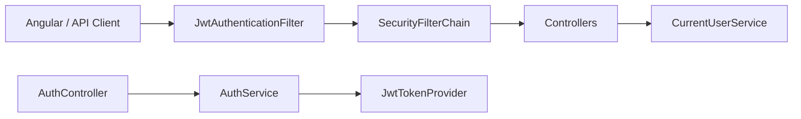
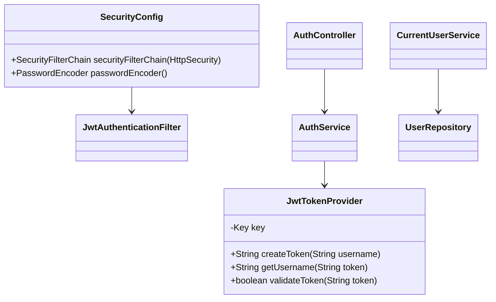

# Security Layer

## 概述

安全层由 `SecurityConfig`、`JwtAuthenticationFilter`、`JwtTokenProvider`、`CurrentUserService`、`AuthController` 和 `AuthService` 组成，提供 JWT 登录、请求过滤、角色校验与用户初始化。默认配置追求易用性，但包含弱口令、宽松 CORS 等问题，需要在生产前加固。

## 架构位置

## 组件概览

### SecurityConfig

- 禁用 CSRF、允许 `*` CORS、无状态 Session。
- 公开 `/api/auth/login`, `/api/auth/logout`, `/h2-console/**`, `/api/test*`。
- 将 `JwtAuthenticationFilter` 注册在 UsernamePasswordAuthenticationFilter 之前。
- Bean: `PasswordEncoder` (BCrypt)。

Source: [📄](file://c:/Users/Administrator/Downloads/hackathon-report-app/backend/src/main/java/com/legacy/report/config/SecurityConfig.java#L17-L55)

### JwtTokenProvider

- 从 `security.jwt.secret` 读取密钥并在 `@PostConstruct` 生成 `Key`。
- `createToken` 仅包含 `sub`，无角色声明。
- `validateToken` 捕获 `JwtException` 并返回布尔值。

Source: [📄](file://c:/Users/Administrator/Downloads/hackathon-report-app/backend/src/main/java/com/legacy/report/security/JwtTokenProvider.java#L1-L60)

### JwtAuthenticationFilter

- 放行 `/api/auth/**`，其他请求提取 `Authorization: Bearer`。
- 验证 token 后，将用户名放入 `SecurityContext`，Authorities 为空集合。

Source: [📄](file://c:/Users/Administrator/Downloads/hackathon-report-app/backend/src/main/java/com/legacy/report/security/JwtAuthenticationFilter.java#L1-L48)

### AuthController & AuthService

- `/api/auth/login`：验证用户名密码、返回 token + 用户信息。  
- `/profile`：根据 `Principal` 返回 `UserDto`。  
- `/logout`：返回静态消息，无 token 黑名单。  
- `AuthService#login` 借助 `PasswordEncoder` + `JwtTokenProvider`。  

Source: [📄Controller](file://c:/Users/Administrator/Downloads/hackathon-report-app/backend/src/main/java/com/legacy/report/controller/AuthController.java#L1-L54) · [📄Service](file://c:/Users/Administrator/Downloads/hackathon-report-app/backend/src/main/java/com/legacy/report/service/AuthService.java#L1-L34)

### CurrentUserService

- 读取 `SecurityContextHolder`，依据用户名查询 `UserRepository`。
- `requireRole` 使用逗号分隔字符串匹配角色。

Source: [📄](file://c:/Users/Administrator/Downloads/hackathon-report-app/backend/src/main/java/com/legacy/report/service/CurrentUserService.java#L1-L44)

### UserInitializer

- 应用启动时创建 admin/maker/checker 账户，密码均为 `123456`，便于演示。  
Source: [📄](file://c:/Users/Administrator/Downloads/hackathon-report-app/backend/src/main/java/com/legacy/report/config/UserInitializer.java#L1-L45)

## 类图

## 安全分析

| ID | 类型 | 位置 | 严重程度 | 修复方案 |
| -- | ---- | ---- | -------- | ------- |
| VUL-002 | 弱口令初始化 | `UserInitializer` 固定密码 123456 | 🟡 中 | 改为随机密码或要求启动时输入，提供自助重置流程。 |
| VUL-003 | 宽松 CORS | `SecurityConfig#cors` 允许任意来源 | 🟡 中 | 在生产环境中限制域名，启用凭证。 |
| VUL-009 | 角色硬编码 | `CurrentUserService#requireRole` | 🟡 中 | 切换到 Spring Security Authorities + @PreAuthorize。 |
| VUL-015 | 缺少 token 撤销 | `/api/auth/logout` 不生效 | 🟢 低 | 引入 token 黑名单或短期 token + refresh。 |
| VUL-016 | Authorities 为空 | `JwtAuthenticationFilter` 未填充角色 | 🟠 高 | 在 token 中写入角色声明，并映射为 `SimpleGrantedAuthority`，否则所有端点仅依赖业务层自检。 |

## 相关文档

- [后端领域概览](./_index.md)
- [Report API](../api/report-api.md)
- [Auth API](../api/auth-api.md)
- [ReportRunService](report-run-service.md)
- [Doc Map](../doc-map.md)
