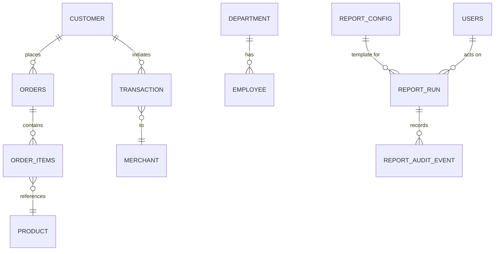
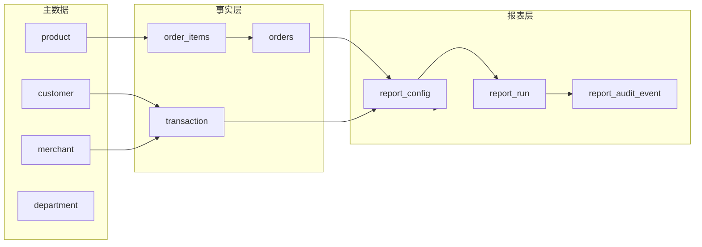

# 数据库架构概览

## 概述

系统默认使用内存 H2 数据库（schema 可迁移至任意 SQL RDBMS）。核心模型分为三层：

1. **业务主数据**：customer、merchant、product、department、employee 等。
2. **交易/订单事实**：transaction、orders、order_items，用于报表统计。
3. **报表运行轨迹**：report_config、report_run、report_audit_event、users。

## 架构图

## 表清单

| 表 | 关键列 | 用途 |
| --- | --- | --- |
| `customer` | `id`, `name`, `credit_score`, `account_balance` | 客户主数据，驱动客户类报表。 |
| `transaction` | `id`, `customer_id`, `merchant_id`, `amount`, `type`, `transaction_date` | 收入/支出流水，是多数报表的事实来源。 |
| `merchant` | `id`, `category`, `commission_rate` | 商户资料，与 transaction 结合计算佣金。 |
| `product` | `id`, `price`, `cost`, `stock_quantity` | 商品主数据、成本信息。 |
| `orders` | `id`, `customer_id`, `order_date`, `total_amount`, `status` | 订单头。 |
| `order_items` | `id`, `order_id`, `product_id`, `quantity`, `unit_price`, `total_price` | 订单明细。 |
| `department` | `id`, `name`, `budget` | 部门预算配置。 |
| `employee` | `id`, `department_id`, `salary`, `status` | 员工信息，用于预算、人效报表。 |
| `report_config` | `id`, `name`, `sql` | 可执行 SQL 模板（详见 `report-config-sql.md`）。 |
| `report_run` | `id`, `report_id`, `status`, `result_snapshot` | 每次报表执行的元数据。 |
| `report_audit_event` | `id`, `report_run_id`, `event_type` | 记录 Maker/Checker 操作轨迹。 |
| `users` | `id`, `username`, `password`, `role` | 后台账户，用于登录与角色校验。 |

## 报表相关表格详解

### report_config

- **目的**：存放可执行 SQL 模板，类型涵盖客户、订单、库存等不同主题。  
- **核心字段**：`name`（英文名称，可在前端映射中文）、`sql`（文本模板）、`description`。  
- **生命周期**：当前项目通过 `data.sql` 初始化，可在后台 API `/api/reports` 创建。  
- **风险**：`sql` 字段被直接执行，无参数绑定，需参阅 [report-config-sql.md](report-config-sql.md) 做安全治理。  

### report_run

- **目的**：记录每次执行报表的结果与状态。Maker 在前端执行 `/reports/{id}/execute` 时创建，Checker 通过 `/report-runs/{id}/decision` 更新状态。  
- **关键字段**：
  - `status`: Generated → Submitted → Approved/Rejected。
  - `maker_username` / `checker_username`: 使用 `users` 表中的用户名。
  - `result_snapshot`: JSON 字符串保存查询结果，用于导出时回放。  
- **索引建议**：在 `report_id`、`status`、`maker_username`、`checker_username` 上添加复合索引以加速列表查询。  

### report_audit_event

- **目的**：审计 Maker/Checker 的操作轨迹（Generated、Submitted、Approved、Rejected、Exported*）。
- **字段说明**：`report_run_id`、`report_id`、`actor_username`、`actor_role`、`event_type`、`comment`。  
- **使用方式**：前端 `ReportRunFlowComponent` 调用 `/report-runs/{id}/audit` 展示时间线。  

### users

- **目的**：保存系统账户，只含用户名、BCrypt 密码、角色（`MAKER`、`CHECKER`）。
- **初始化**：`UserInitializer` 写入 admin/maker1/checker1，密码 123456。  
- **建议**：生产环境需扩展字段（邮箱、状态、创建时间）并移除硬编码密码。  

## 数据流

- **写入路径**：应用启动时通过 `schema.sql` & `data.sql` 初始化。业务逻辑主要是只读操作（生成报表、导出）。
- **读取路径**：ReportService 直接执行 `report_config.sql` 字段内容，ReportRunService/JPA 读取运行记录。

## 约束与注意事项

1. **缺少外键定义**：`schema.sql` 只在部分表声明外键（orders/order_items），其余依赖业务约定。迁移到生产需补全 FK。  
2. **SQL 模板执行风险**：report_config 的 SQL 被直接执行，没有参数绑定。需参考 [report-config-sql.md](report-config-sql.md) 做白名单管理。  
3. **H2 方言**：大量模板使用 `DATE_TRUNC`、窗口函数等 PostgreSQL 语法，若切换数据库需调整。  
4. **审计日志体量**：report_run 与 report_audit_event 可能快速增长，建议定期归档。  

## 相关文档

- [系统架构](../architecture.md)
- [report_config SQL 解析](report-config-sql.md)
- [后端领域概览](../后端/_index.md)
- [ReportRunService](../后端/report-run-service.md)
